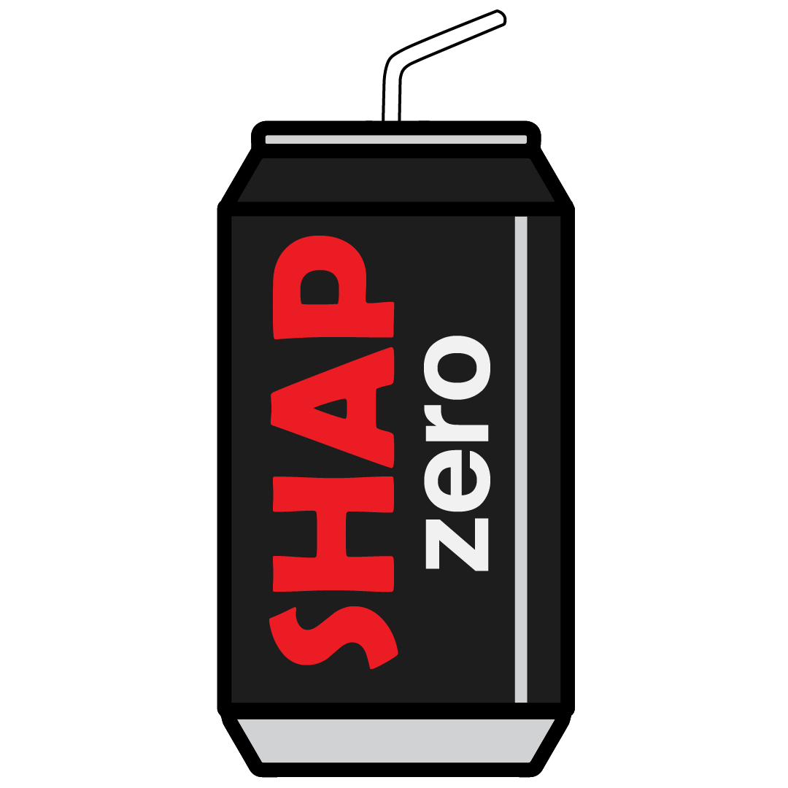

# SHAP zero Explains Genomic Models with Near-zero Marginal Cost for Future Queried Sequences

SHAP zero is an amortized inference method for approximating SHAP values and Shapley interactions. This repository contains code from the article "SHAP zero Explains Genomic Models with Near-zero Marginal Cost for Future Queried Sequences" by Darin Tsui, Aryan Musharaf, Yigit Efe Erginbas, Justin Singh Kang, and Amirali Aghazadeh. 

## Quick start

A full tutorial on how to reproduce experiments here has been left in the TIGER folder, as well as steps on how to run your own SHAP zero experiments. We recommend you start from the TIGER folder first, as the inDelphi model works on an older Python version.  

## Description of folders

**TIGER/:** folder to reproduce TIGER experiments. A full tutorial has been left in the folder. 

**inDelphi/:** folder to reproduce inDelphi experiments. The file structure is identical to TIGER's. 

**gen/:** general purpose functions. 

**qsft/:** functions needed to run the sparse Fourier algorithm *q*-SFT.
